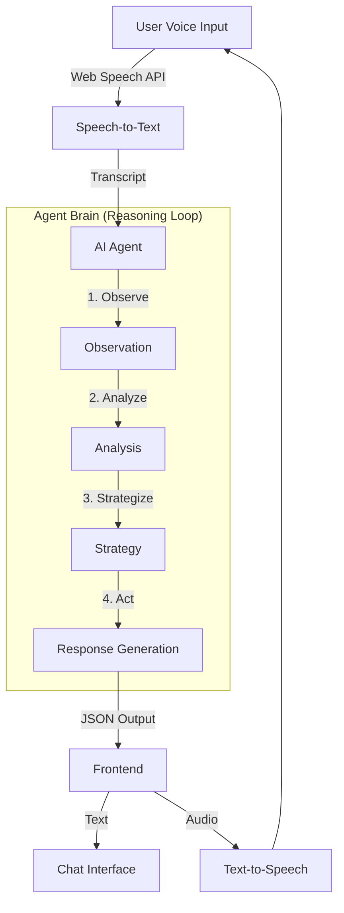
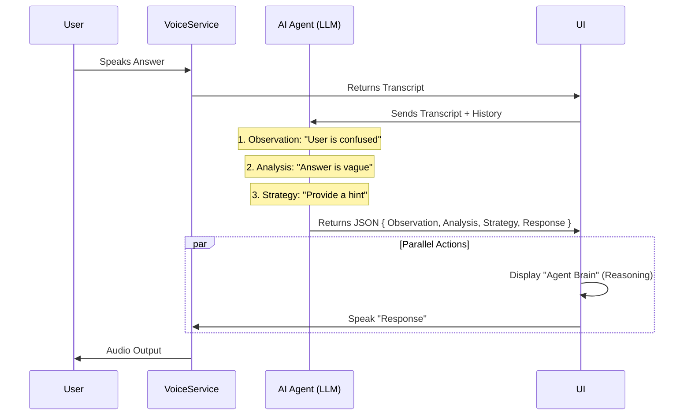

# Interview Practice Partner

An AI-powered agent that conducts mock interviews, adapts to your responses, and provides detailed feedback.

## Features

- **Voice-First Interaction**: Uses the Web Speech API for a natural, conversational experience.
- **Adaptive AI**: The agent adjusts its questioning style based on your behavior (Confused, Efficient, Chatty).
- **Real-time Visualizer**: Visual feedback for microphone input.
- **Comprehensive Feedback**: Generates a detailed report card with score, strengths, and weaknesses after the session.
- **Customizable**: Choose your target role and difficulty level.

## Design Decisions

### 1. Voice-First Architecture
I prioritized voice interaction to simulate real interview conditions. The `VoiceService` abstraction handles Speech-to-Text (STT) and Text-to-Speech (TTS) using native browser APIs to ensure low latency and zero cost compared to cloud-based audio services.

### 2. Client-Side State Management
Using `React Context` and `useReducer` allows for a complex state machine (Setup -> Interview -> Feedback) without the need for a heavy backend. The interview history is kept in memory for the duration of the session.

### 3. Direct LLM Integration
The application calls the Gemini API directly from the client. In a production environment, this would be proxied through a backend to secure the API key. For this prototype, user-provided keys are stored in `localStorage` for convenience.

### 4. Adaptive System Prompt
The system prompt is engineered to handle specific user personas:
- **Confused**: Provides hints and guidance.
- **Efficient**: Probes deeper with follow-ups.
- **Chatty**: Steers conversation back to the topic.

## Tech Stack

- **Frontend**: React (Vite)
- **Styling**: CSS Modules + Global Variables (Glassmorphism UI)
- **AI/LLM**: Google Gemini API (gemini-2.5-flash)
- **Voice**: Web Speech API (SpeechRecognition & SpeechSynthesis)
- **Icons**: Lucide React

## Project Structure

```
src/
├── components/
│   ├── Feedback/       # Post-interview report card
│   ├── Interview/      # Main interview interface (Chat, Visualizer, Controls)
│   ├── Setup/          # Role & Difficulty configuration
│   └── UI/             # Reusable primitives (Button, Input)
├── context/            # Global state (InterviewContext)
├── services/
│   ├── llm.js          # Gemini API integration with Agentic Loop
│   └── voice.js        # Browser Speech API wrapper
└── styles/             # Global CSS variables
```

## Setup

1. Clone the repository.
2. Run `npm install`.
3. Run `npm run dev`.
4. Open the app and enter your Gemini API Key.

## System Architecture

The application follows a true **Agentic Workflow** using an **Observe-Reason-Act** loop. It is not a simple chatbot; it explicitly analyzes the user's intent before formulating a strategy.



## Agentic Sequence Diagram


